<!---
# This file is auto-generated. Do not edit.
# cspell:disable
--->
# Performance Report

```mermaid
xychart-beta
    title Files Per Second by Day
    y-axis Files per Second
    x-axis Date [Aug-26, Aug-27, Aug-28, Aug-29, Aug-30, Aug-31, Sep-1, Sep-2, Sep-3, Sep-4, Sep-6, Sep-8, Sep-10, Sep-12, Sep-14, Sep-16, Sep-17, Sep-20, Sep-22, Sep-25]
    bar [190.24, 185.15, 191.23, 195.37, 191.39, 193.00, 190.75, 190.15, 197.37, 189.85, 196.95, 191.17, 190.61, 191.83, 197.87, 189.83, 198.93, 223.14, 203.41, 193.61]
    line [184.75, 158.60, 171.47, 169.60, 183.25, 175.44, 159.48, 161.70, 160.46, 160.16, 159.37, 153.77, 161.06, 165.68, 159.91, 274.11, 160.48, 154.49, 133.29, 158.71]
    line [45.60, 46.71, 50.51, 48.37, 46.85, 59.90, 48.04, 50.57, 60.39, 48.74, 45.74, 54.53, 48.10, 54.31, 47.78, 46.42, 45.99, 42.51, 50.42, 46.47]
    line [55.64, 55.71, 59.28, 54.85, 60.20, 59.04, 56.12, 68.78, 56.21, 56.11, 49.06, 62.47, 53.43, 54.08, 56.65, 66.08, 70.58, 54.86, 55.17, 64.25]
    line [6.64, 6.06, 6.53, 6.57, 8.03, 6.52, 6.59, 6.44, 6.39, 6.52, 8.53, 6.71, 7.87, 6.93, 6.69, 7.98, 6.67, 6.83, 6.48, 6.55]
    line [186.49, 182.43, 194.97, 183.27, 194.85, 191.03, 183.63, 183.06, 181.63, 179.83, 187.37, 210.54, 236.79, 184.39, 226.41, 183.84, 178.08, 240.62, 182.34, 183.74]
    line [143.02, 122.15, 142.33, 130.77, 150.54, 129.50, 127.85, 161.72, 142.89, 142.67, 128.62, 122.28, 150.41, 127.69, 119.42, 176.53, 123.45, 123.33, 163.66, 128.74]
    line [170.66, 160.71, 152.01, 148.28, 159.68, 156.83, 191.47, 145.84, 161.62, 164.09, 146.75, 148.35, 206.25, 150.67, 151.50, 140.12, 185.15, 139.87, 144.59, 182.57]
    line [24.43, 25.37, 25.72, 26.51, 26.59, 24.79, 26.51, 29.88, 26.76, 29.99, 25.16, 26.46, 26.09, 28.54, 23.63, 25.87, 21.39, 25.97, 25.29, 0.00]
    line [21.74, 19.44, 19.50, 19.20, 19.98, 20.35, 18.20, 18.80, 20.78, 20.30, 27.69, 23.39, 17.95, 19.65, 18.79, 24.79, 24.63, 19.73, 20.13, 0.00]
    line [78.77, 75.57, 73.80, 69.15, 78.35, 81.24, 69.03, 86.32, 67.78, 71.51, 67.14, 65.29, 70.06, 74.08, 63.80, 67.85, 68.28, 64.95, 121.18, 70.36]
    line [98.28, 96.78, 104.60, 101.13, 109.23, 99.73, 101.36, 109.96, 98.07, 116.80, 99.03, 95.60, 99.87, 99.90, 101.98, 98.46, 103.01, 98.38, 99.03, 0.00]
    line [591.49, 390.96, 423.25, 409.89, 420.57, 392.45, 484.50, 460.60, 386.17, 437.93, 376.78, 397.57, 392.00, 400.11, 531.12, 384.37, 384.60, 745.85, 398.12, 397.34]
    line [21.22, 21.19, 22.04, 29.75, 23.02, 22.87, 20.05, 21.21, 24.74, 22.92, 26.72, 20.85, 24.50, 21.07, 20.76, 21.20, 21.42, 29.89, 21.10, 20.54]
    line [104.38, 94.67, 92.38, 93.95, 104.17, 91.62, 84.72, 84.00, 108.68, 78.26, 88.95, 80.83, 82.91, 82.03, 82.90, 86.51, 81.41, 84.89, 78.73, 81.82]
    line [381.52, 374.08, 409.79, 391.59, 445.01, 453.72, 363.41, 425.43, 395.65, 408.80, 430.33, 376.07, 371.64, 390.41, 381.43, 392.33, 359.21, 375.60, 366.33, 371.02]
    line [140.74, 138.14, 147.54, 146.55, 146.02, 154.94, 154.92, 173.52, 133.16, 154.40, 151.68, 142.86, 132.44, 134.89, 191.12, 144.91, 193.30, 142.56, 168.42, 128.44]
    line [81.00, 98.60, 83.62, 80.81, 95.31, 95.53, 87.87, 82.74, 85.96, 92.06, 85.17, 89.98, 69.10, 91.26, 130.94, 82.16, 79.40, 98.84, 72.96, 83.11]
    line [173.59, 180.48, 179.74, 243.56, 182.28, 198.12, 173.20, 197.43, 208.77, 179.57, 168.18, 209.46, 169.33, 212.19, 179.89, 238.35, 171.61, 172.61, 177.91, 178.22]
    line [351.25, 341.51, 360.76, 340.11, 354.77, 349.07, 349.21, 351.71, 366.86, 345.42, 349.08, 401.47, 446.16, 355.63, 318.90, 363.44, 349.72, 406.48, 449.44, 346.87]
    line [266.69, 244.68, 307.76, 255.74, 281.64, 288.18, 264.41, 254.46, 262.80, 279.68, 349.40, 267.60, 261.93, 287.76, 262.40, 339.51, 263.75, 234.66, 253.01, 432.43]
    line [143.51, 123.67, 127.21, 130.16, 128.18, 136.84, 128.57, 138.89, 167.86, 124.57, 126.57, 119.58, 171.63, 125.66, 126.89, 119.89, 121.04, 127.46, 154.00, 126.54]
    line [79.78, 75.90, 79.64, 81.40, 79.85, 79.89, 74.06, 94.44, 98.41, 75.35, 75.22, 74.82, 78.42, 89.26, 79.87, 74.03, 79.32, 76.57, 77.71, 78.13]
    line [24.32, 26.78, 24.44, 32.43, 29.19, 26.35, 24.36, 24.17, 24.77, 25.69, 23.39, 29.52, 23.91, 25.15, 23.74, 22.20, 23.03, 24.38, 22.79, 23.06]
    line [199.46, 185.25, 194.89, 191.72, 195.81, 191.06, 231.16, 206.13, 208.21, 222.66, 193.65, 167.61, 190.13, 221.56, 177.63, 183.43, 188.58, 244.43, 196.97, 191.64]
    line [262.94, 364.38, 287.21, 267.07, 273.26, 272.63, 293.89, 254.88, 261.45, 256.16, 262.71, 281.41, 341.82, 253.99, 265.83, 272.53, 247.23, 246.03, 470.19, 273.87]
    line [213.43, 211.78, 245.83, 346.89, 231.16, 212.83, 215.37, 228.66, 222.75, 208.88, 207.83, 208.53, 367.52, 230.07, 204.55, 207.72, 211.00, 215.66, 277.45, 281.32]
    line [229.99, 225.97, 249.68, 224.12, 249.45, 250.62, 224.68, 245.58, 246.49, 229.93, 221.20, 224.86, 216.89, 259.14, 277.45, 226.45, 225.10, 268.40, 226.40, 0.00]
    line [224.56, 256.87, 257.70, 287.97, 268.68, 222.58, 222.07, 229.04, 229.68, 226.40, 222.19, 220.27, 226.37, 235.76, 281.57, 222.43, 291.44, 219.17, 221.75, 232.57]
    line [125.42, 125.26, 127.33, 120.64, 133.49, 122.01, 125.69, 124.63, 138.77, 133.95, 120.16, 123.66, 119.12, 133.12, 118.61, 125.51, 156.41, 126.36, 117.29, 122.74]
    line [272.30, 280.33, 252.18, 242.64, 242.97, 290.78, 240.40, 234.87, 270.15, 260.38, 238.70, 329.95, 229.46, 255.09, 303.17, 236.15, 234.71, 233.17, 234.84, 238.45]
    line [15.63, 14.69, 17.08, 14.10, 16.71, 20.24, 15.82, 15.08, 17.27, 15.55, 14.37, 16.80, 21.93, 17.01, 17.04, 25.59, 14.10, 13.68, 15.06, 0.00]
    line [123.35, 123.11, 143.71, 157.94, 138.50, 140.06, 128.47, 140.20, 125.82, 152.47, 153.10, 126.38, 125.97, 124.19, 127.77, 210.87, 148.03, 126.65, 140.55, 0.00]
    line [103.09, 93.25, 94.27, 95.28, 96.54, 94.13, 99.46, 106.04, 103.70, 101.61, 179.98, 95.75, 97.23, 107.06, 93.89, 113.70, 92.25, 94.28, 98.57, 121.96]
    line [151.70, 148.17, 156.31, 149.39, 153.11, 153.94, 154.04, 151.51, 150.42, 164.46, 144.04, 144.33, 151.54, 146.78, 197.07, 148.01, 150.26, 150.22, 155.16, 0.00]
    line [251.01, 260.27, 254.92, 257.60, 260.42, 243.47, 321.12, 238.92, 262.66, 250.38, 355.46, 248.94, 253.18, 270.83, 243.92, 325.88, 260.22, 243.99, 243.96, 432.65]
    line [99.58, 101.28, 109.08, 102.06, 113.06, 106.63, 101.22, 99.00, 102.40, 108.26, 99.53, 99.63, 98.76, 103.06, 96.78, 160.57, 101.71, 98.32, 105.51, 128.16]
    line [198.49, 245.94, 225.24, 218.17, 233.60, 214.50, 206.09, 260.46, 254.83, 225.39, 210.16, 218.01, 213.19, 249.06, 214.17, 355.08, 286.90, 193.09, 220.97, 362.45]
    line [45.91, 59.43, 48.16, 47.53, 46.75, 48.25, 57.12, 55.04, 46.08, 52.57, 46.47, 56.14, 46.33, 51.70, 44.11, 74.38, 48.80, 46.22, 56.03, 67.65]
    line [263.50, 263.68, 284.05, 303.63, 278.91, 256.34, 262.12, 254.81, 252.73, 280.38, 314.32, 249.04, 256.96, 250.64, 247.49, 246.97, 251.50, 236.84, 249.23, 248.28]
    line [215.33, 194.36, 206.72, 199.24, 215.14, 225.49, 194.47, 193.04, 188.70, 189.46, 189.29, 188.79, 176.65, 217.04, 317.36, 187.32, 321.78, 198.42, 179.83, 184.14]
    line [214.07, 290.22, 216.81, 359.94, 225.73, 203.55, 198.31, 204.42, 207.30, 236.03, 217.73, 206.74, 361.86, 212.41, 213.84, 211.89, 203.30, 203.26, 249.81, 211.62]
    line [96.14, 97.78, 99.79, 92.99, 92.61, 91.86, 94.75, 119.70, 107.86, 89.92, 92.48, 95.62, 122.20, 102.97, 97.36, 113.44, 95.42, 93.37, 113.84, 91.89]
    line [195.90, 170.00, 175.89, 161.05, 172.78, 181.80, 171.34, 164.16, 172.60, 156.60, 164.51, 155.95, 162.53, 193.68, 156.67, 149.67, 167.24, 171.44, 166.11, 158.33]
    line [39.47, 36.12, 40.86, 48.01, 38.35, 36.34, 36.12, 46.76, 38.88, 37.13, 34.45, 34.97, 52.27, 41.14, 33.93, 34.79, 33.36, 33.83, 35.26, 36.82]
    line [208.72, 201.20, 222.72, 313.85, 230.65, 207.01, 226.55, 228.01, 236.78, 227.33, 208.49, 230.64, 206.81, 229.76, 276.88, 185.15, 203.08, 216.06, 205.09, 300.26]
    line [81.92, 82.24, 92.49, 81.67, 87.59, 83.98, 86.34, 113.37, 99.81, 81.83, 79.32, 79.69, 86.08, 90.96, 77.91, 142.49, 79.52, 110.64, 76.31, 124.42]
    line [36.94, 35.58, 41.81, 37.53, 40.57, 37.73, 62.90, 58.74, 49.12, 53.66, 48.09, 48.30, 53.96, 52.43, 61.82, 49.92, 50.20, 50.36, 50.54, 56.39]
    line [211.98, 216.89, 208.83, 377.28, 231.14, 271.29, 215.41, 231.46, 211.65, 226.30, 254.34, 225.06, 179.78, 228.82, 211.67, 318.15, 234.86, 348.02, 254.54, 214.39]
    line [195.34, 186.50, 194.59, 201.00, 192.78, 193.23, 197.26, 194.56, 204.26, 190.93, 174.46, 207.05, 194.56, 194.84, 248.77, 196.63, 194.10, 246.18, 197.54, 193.42]
    line [166.64, 168.34, 182.86, 173.63, 176.66, 185.43, 171.13, 167.67, 190.75, 177.89, 199.59, 191.33, 170.36, 179.54, 171.09, 160.76, 222.99, 297.37, 220.86, 166.97]
```

Daily Performance

Time to Process Files

| Repository                                      | Elapsed | Min/Avg/Max          |    SD | SD Graph                |
| ----------------------------------------------- | ------: | :------------------: | ----: | ----------------------- |
| AdaDoom3/AdaDoom3                    |    2.80 | 2.0 /   2.7 /   3.2  |  0.32 | `    ┣━━┻━━╋●━┻━━┫    ` |
| alexiosc/megistos                    |    7.01 | 4.5 /   6.7 /   8.4  |  0.88 | `    ┣━━┻━━╋●━┻━━┫    ` |
| apollographql/apollo-server          |    2.59 | 1.8 /   2.5 /   2.8  |  0.23 | `     ┣━┻━━╋●━┻━┫     ` |
| aspnetboilerplate/aspnetboilerplate  |    8.36 | 4.9 /   8.4 /   9.8  |  1.03 | `    ┣━━┻━━●━━┻━━┫    ` |
| aws-amplify/docs                     |   13.46 | 8.6 /  12.7 /  14.3  |  1.41 | `    ┣━━┻━━╋━●┻━━┫    ` |
| Azure/azure-rest-api-specs           |    5.97 | 7.3 /  10.0 /  11.6  |  0.87 | `●    ┣━━┻━╋━┻━━┫     ` |
| bitjson/typescript-starter           |    0.99 | 0.7 /   1.0 /   1.1  |  0.10 | `     ┣━┻━━●━━┻━┫     ` |
| caddyserver/caddy                    |    3.81 | 2.2 /   3.5 /   3.9  |  0.38 | `    ┣━━┻━━╋━━●━━┫    ` |
| canada-ca/open-source-logiciel-libre |    1.07 | 0.6 /   1.0 /   1.2  |  0.10 | `     ┣━┻━━╋●━┻━┫     ` |
| chef/chef                            |    3.45 | 3.1 /   4.7 /   5.6  |  0.59 | `    ●━━┻━━╋━━┻━━┫    ` |
| dart-lang/sdk                        |   60.46 | 46.9 /  59.4 /  66.8 |  3.97 | `   ┣━━┻━━━╋●━━┻━━┫   ` |
| django/django                        |   10.43 | 7.5 /  13.1 /  15.1  |  1.70 | `    ┣●━┻━━╋━━┻━━┫    ` |
| eslint/eslint                        |    9.74 | 5.4 /   9.2 /  11.6  |  1.34 | `    ┣━━┻━━╋●━┻━━┫    ` |
| exonum/exonum                        |    3.43 | 2.6 /   3.3 /   3.6  |  0.28 | `    ┣━━┻━━╋━●┻━━┫    ` |
| flutter/samples                      |   13.26 | 7.1 /  11.7 /  13.9  |  1.48 | `    ┣━━┻━━╋━━●━━┫    ` |
| gitbucket/gitbucket                  |    3.00 | 2.0 /   3.1 /   3.6  |  0.43 | `    ┣━━┻━●╋━━┻━━┫    ` |
| googleapis/google-cloud-cpp          |  131.99 | 74.1 / 122.5 / 142.3 | 14.56 | `  ┣━━━┻━━━╋━━●┻━━━┫  ` |
| graphql/express-graphql              |    1.13 | 0.7 /   1.0 /   1.2  |  0.13 | `     ┣━┻━━╋━●┻━┫     ` |
| graphql/graphql-js                   |    3.55 | 2.6 /   3.6 /   4.0  |  0.25 | `    ┣━━┻━●╋━━┻━━┫    ` |
| graphql/graphql-relay-js             |    1.11 | 0.7 /   1.1 /   1.3  |  0.13 | `     ┣━┻━━╋●━┻━┫     ` |
| graphql/graphql-spec                 |    1.26 | 0.7 /   1.2 /   1.4  |  0.18 | `     ┣━┻━━╋●━┻━┫     ` |
| iluwatar/java-design-patterns        |   12.56 | 7.0 /  11.7 /  13.3  |  1.41 | `    ┣━━┻━━╋━●┻━━┫    ` |
| ktaranov/sqlserver-kit               |    3.94 | 3.1 /   5.6 /   6.4  |  0.83 | `    ●━━┻━━╋━━┻━━┫    ` |
| liriliri/licia                       |    3.89 | 2.8 /   3.6 /   4.1  |  0.39 | `    ┣━━┻━━╋━●┻━━┫    ` |
| MartinThoma/LaTeX-examples           |    6.08 | 3.5 /   5.9 /   6.7  |  0.69 | `    ┣━━┻━━╋●━┻━━┫    ` |
| mdx-js/mdx                           |    1.78 | 1.1 /   1.7 /   2.0  |  0.21 | `     ┣━┻━━╋●━┻━┫     ` |
| microsoft/TypeScript-Website         |    4.19 | 3.7 /   4.9 /   5.6  |  0.52 | `    ┣━●┻━━╋━━┻━━┫    ` |
| MicrosoftDocs/PowerShell-Docs        |   24.71 | 14.7 /  23.9 /  28.2 |  2.78 | `   ┣━━━┻━━╋●━┻━━━┫   ` |
| neovim/nvim-lspconfig                |    5.55 | 3.2 /   5.1 /   5.9  |  0.54 | `    ┣━━┻━━╋━●┻━━┫    ` |
| pagekit/pagekit                      |    2.04 | 1.9 /   3.2 /   4.1  |  0.44 | `  ● ┣━━┻━━╋━━┻━━┫    ` |
| php/php-src                          |   19.64 | 13.3 /  24.0 /  26.8 |  2.58 | `   ┣●━━┻━━╋━━┻━━━┫   ` |
| plasticrake/tplink-smarthome-api     |    1.33 | 0.9 /   1.2 /   1.5  |  0.15 | `     ┣━┻━━╋━●┻━┫     ` |
| prettier/prettier                    |    7.85 | 5.9 /   7.6 /   8.5  |  0.63 | `    ┣━━┻━━╋●━┻━━┫    ` |
| pycontribs/jira                      |    1.25 | 0.8 /   1.4 /   1.8  |  0.17 | `     ┣━┻●━╋━━┻━┫     ` |
| RustPython/RustPython                |   11.71 | 5.6 /  10.1 /  12.6  |  1.43 | `    ┣━━┻━━╋━━┻●━┫    ` |
| shoelace-style/shoelace              |    2.77 | 1.6 /   2.6 /   3.3  |  0.30 | `    ┣━━┻━━╋●━┻━━┫    ` |
| slint-ui/slint                       |   17.49 | 9.5 /  15.7 /  17.8  |  1.93 | `   ┣━━━┻━━╋━━●━━━┫   ` |
| SoftwareBrothers/admin-bro           |    2.40 | 1.8 /   2.3 /   2.5  |  0.18 | `     ┣━┻━━╋●━┻━┫     ` |
| sveltejs/svelte                      |   22.89 | 12.2 /  21.6 /  26.2 |  2.92 | `   ┣━━━┻━━╋━●┻━━━┫   ` |
| TheAlgorithms/Python                 |    6.46 | 4.2 /   5.4 /   6.4  |  0.50 | `    ┣━━┻━━╋━━┻━━●    ` |
| twbs/bootstrap                       |    1.68 | 1.0 /   1.6 /   1.9  |  0.22 | `     ┣━┻━━╋●━┻━┫     ` |
| typescript-cheatsheets/react         |    1.17 | 0.8 /   1.1 /   1.2  |  0.12 | `     ┣━┻━━╋━●┻━┫     ` |
| typescript-eslint/typescript-eslint  |    4.16 | 2.4 /   4.0 /   4.5  |  0.49 | `    ┣━━┻━━╋●━┻━━┫    ` |
| vitest-dev/vitest                    |    6.50 | 6.6 /  10.2 /  12.0  |  1.16 | `●   ┣━━┻━━╋━━┻━━┫    ` |
| w3c/aria-practices                   |    3.24 | 2.1 /   3.0 /   3.6  |  0.39 | `    ┣━━┻━━╋●━┻━━┫    ` |
| w3c/specberus                        |    1.48 | 1.2 /   1.8 /   2.1  |  0.19 | `     ●━┻━━╋━━┻━┫     ` |
| webdeveric/webpack-assets-manifest   |    0.81 | 0.7 /   1.1 /   1.3  |  0.14 | `    ●┣━┻━━╋━━┻━┫     ` |
| webpack/webpack                      |    7.96 | 4.4 /   6.8 /   8.2  |  0.87 | `    ┣━━┻━━╋━━┻●━┫    ` |
| wireapp/wire-desktop                 |    1.26 | 0.9 /   1.3 /   1.5  |  0.15 | `     ┣━┻━●╋━━┻━┫     ` |
| wireapp/wire-webapp                  |   14.01 | 7.5 /  13.1 /  16.8  |  1.62 | `    ┣━━┻━━╋━●┻━━┫    ` |

Note:
- Elapsed time is in seconds.

Files per Second over Time

| Repository                                      | Files |    Sec |    Fps |     Rel | Trend Fps              |    N |
| ----------------------------------------------- | ----: | -----: | -----: | ------: | ---------------------- | ---: |
| AdaDoom3/AdaDoom3                    |   103 |   2.80 |  36.82 |  -5.64% | `▃▃▆▂▂▂▂▂█▃▆▅▆▂▂▂▂▂▂▃` |   48 |
| alexiosc/megistos                    |   583 |   7.01 |  83.11 |  -7.06% | `▇▃▃▃▃▂▅▁▆▅▂▃▄▃█▃▂▅▂▃` |   49 |
| apollographql/apollo-server          |   256 |   2.59 |  99.03 |  -4.58% | `█▃▃▃█▃▂▂▃▂▂▃▃▃▃▃▃▃▃▃` |   48 |
| aspnetboilerplate/aspnetboilerplate  |  2290 |   8.36 | 273.87 |  -0.99% | `▂▂▂▂▂▂▃▄▂▂▂▂▂▂▂▂▂▂█▂` |   49 |
| aws-amplify/docs                     |  3048 |  13.46 | 226.40 |  -6.87% | `▃▃▃▂▃▂▃▂▂▅▂▇▃▃█▆▃▃▅▃` |   48 |
| Azure/azure-rest-api-specs           |  2583 |   5.97 | 432.65 |  66.23% | `▂▂▃▂▆▂▂▂▄▅▃▂▂▂▂▅▂▂▂█` |   49 |
| bitjson/typescript-starter           |    20 |   0.99 |  20.13 |  -1.10% | `▂▂▇▂▂█▃▇▂▂▃▃▂▃▃▂▆▆▃▃` |   48 |
| caddyserver/caddy                    |   350 |   3.81 |  91.89 |  -7.84% | `▂▂▂▃▃▄▃██▃▃▃▇▃▄▆▃▃▆▃` |   48 |
| canada-ca/open-source-logiciel-libre |     7 |   1.07 |   6.55 |  -4.85% | `▄▄▃▄█▄▄▇▃▄▅▄▄▇▄▇▄▄▄▄` |   49 |
| chef/chef                            |  1037 |   3.45 | 300.26 |  33.25% | `▂▇▃▃▃▃▅▃▇▃▄▅▃▃▇▂▃▃▃█` |   49 |
| dart-lang/sdk                        | 11695 |  60.46 | 193.42 |  -1.84% | `▄▄▂▃▂▆▃▄▄▄▃▄▄▃█▄▄█▄▄` |   48 |
| django/django                        |  2935 |  10.43 | 281.32 |  22.48% | `▂▂▂▂▂▂▂▂█▄▂▂▃▂▂▂▂▂▅▅` |   48 |
| eslint/eslint                        |  2088 |   9.74 | 214.39 |  -8.11% | `▂▃▂▆▄▄▃▁▂▅▂▅▂▂▃▇▃█▄▃` |   49 |
| exonum/exonum                        |   421 |   3.43 | 122.74 |  -5.14% | `█▃█▂▃▄▃▃▄▅▅▄▄▇▃▄█▄▂▃` |   49 |
| flutter/samples                      |  1703 |  13.26 | 128.44 | -13.50% | `▃▆▅▂▄▃▄▃▂▂▂▃▄▃█▄█▃▆▂` |   49 |
| gitbucket/gitbucket                  |   422 |   3.00 | 140.55 |   2.10% | `▆▅▂▅▂▄▂▂▂▂▂▂▂▂▂▂█▄▂▃` |   48 |
| googleapis/google-cloud-cpp          | 22038 | 131.99 | 166.97 |  -8.72% | `▃▂▂▂▃▄▂▂▂▂▂▂▂▄▂▂▅█▄▂` |   49 |
| graphql/express-graphql              |    26 |   1.13 |  23.06 | -10.48% | `▂▂▅▅▂█▂▂▂▃▂▆▃▂▂▂▂▃▂▂` |   49 |
| graphql/graphql-js                   |   551 |   3.55 | 155.16 |   1.14% | `▃▃▃▃█▂▂▃▃▃▃▂▂▂▃▇▃▃▃▃` |   48 |
| graphql/graphql-relay-js             |    28 |   1.11 |  25.29 |  -5.62% | `▇▂▅▂▅▃▃▃▃█▅▃▃▃▂▂▃▁▃▃` |   48 |
| graphql/graphql-spec                 |    19 |   1.26 |  15.06 | -10.24% | `▂▄▂▂▂▂▄▂▆▅▁▂▃▆▃▃█▂▁▂` |   48 |
| iluwatar/java-design-patterns        |  2239 |  12.56 | 178.22 |  -6.79% | `▂▂▂▁▁▂▄▁▂▄▃▂█▂▂▅▂▂▂▂` |   49 |
| ktaranov/sqlserver-kit               |   490 |   3.94 | 124.42 |  37.86% | `▂▂▂▂▂▂▁▂▂▅▂▂▄▂▁█▂▅▁▆` |   49 |
| liriliri/licia                       |  1442 |   3.89 | 371.02 |  -8.52% | `█▇▃▂▆▄▃▃▃▇▄▄▃▃▄▄▃▃▃▃` |   48 |
| MartinThoma/LaTeX-examples           |  1414 |   6.08 | 232.57 |  -3.80% | `▄▄▄▃▃▄▂▃▃▄▂█▃▄▇▃█▃▃▄` |   49 |
| mdx-js/mdx                           |   139 |   1.78 |  78.13 |  -4.84% | `▂▂▂▂▂▂▂▂▅▂▂▂█▃▂▂▂▂▂▂` |   49 |
| microsoft/TypeScript-Website         |   765 |   4.19 | 182.57 |  15.84% | `▃▇▆▃▃▃▂█▂▂▂▃▆▂▃▂▆▂▂▆` |   49 |
| MicrosoftDocs/PowerShell-Docs        |  3127 |  24.71 | 126.54 |  -4.84% | `▃▃▃▃▃▃▂█▆▃▂▃▂▃▃▃▃▃▆▃` |   49 |
| neovim/nvim-lspconfig                |   878 |   5.55 | 158.33 |  -7.98% | `▂▂▁▂▁▂▂▂▂▅▂▂▂█▂▁▂▃▂▂` |   48 |
| pagekit/pagekit                      |   741 |   2.04 | 362.45 |  54.50% | `▂▂▂▄▂▂▂▂▂▂▄█▃▂▂▇▅▁▂▇` |   49 |
| php/php-src                          |  2395 |  19.64 | 121.96 |  20.58% | `▂▂▂▂█▂▂▂▄▂▂▂▂▄▂▃▁▂▂▄` |   49 |
| plasticrake/tplink-smarthome-api     |    62 |   1.33 |  46.47 |  -8.57% | `▃▃▇▂▃▃█▄▃█▃▄▇█▃▃▃▂▄▃` |   49 |
| prettier/prettier                    |  2722 |   7.85 | 346.87 |  -3.64% | `▃▂▃▄▃█▃█▃▃▃▆▃▂▂▄▃▆█▃` |   49 |
| pycontribs/jira                      |    80 |   1.25 |  64.25 |  10.28% | `▃▂▁▅▂▂█▃▄▃▃▄▄▃▄▆▇▃▃▅` |   49 |
| RustPython/RustPython                |   958 |  11.71 |  81.82 |  -9.97% | `▆▃▆▃█▆▆▆▆▆▅▇▄▇▆▇▆▇▅▆` |   49 |
| shoelace-style/shoelace              |   440 |   2.77 | 158.71 |  -6.14% | `▃▂▃▃▂▂▂▃▃▂▃▂▄▂▂█▃▂▁▂` |   49 |
| slint-ui/slint                       |  4171 |  17.49 | 238.45 |  -7.73% | `▁▄▂▃▂█▁▁▃▁▄▁▂▂▄▂▁▁▁▂` |   49 |
| SoftwareBrothers/admin-bro           |   441 |   2.40 | 183.74 |  -3.70% | `▂▂▃▂▃▃▇█▃▃▃▃▃▃▇▃▂█▃▃` |   49 |
| sveltejs/svelte                      |  9094 |  22.89 | 397.34 |  -7.49% | `▂▄▂▄▂▂▂▂▂▄▂▂▁▂▄▂▂█▂▂` |   49 |
| TheAlgorithms/Python                 |  1605 |   6.46 | 248.28 |  -6.62% | `▄▃▃██▃▃▄▃▂▃▃▄▄▃▃▃▂▃▃` |   49 |
| twbs/bootstrap                       |   118 |   1.68 |  70.36 |  -6.09% | `▂▂▂▄▂▂▁▂▅▃▂▂▁▂▁▂▂▂█▂` |   48 |
| typescript-cheatsheets/react         |    24 |   1.17 |  20.54 |  -9.15% | `▆▂▃▂▆▂▃▅▃▂▃▃▃▂▂▃▃█▃▂` |   49 |
| typescript-eslint/typescript-eslint  |   880 |   4.16 | 211.62 |  -6.00% | `▂▂▄▅▂▂▂█▂▂▃▂▂▂▂▂▂▂▄▂` |   49 |
| vitest-dev/vitest                    |  2809 |   6.50 | 432.43 |  55.06% | `▂▅▂▂▅▂▃▂▅▂▅▂▂▃▂▅▂▁▂█` |   49 |
| w3c/aria-practices                   |   417 |   3.24 | 128.74 |  -7.93% | `▂▂█▃▃▂▂▅▃▃▂▃▃▃▂█▂▂▆▃` |   49 |
| w3c/specberus                        |   190 |   1.48 | 128.16 |  20.83% | `▆▃▃▂▂▂▂▂▅▂▁▂▃▂▂█▂▂▃▅` |   49 |
| webdeveric/webpack-assets-manifest   |    55 |   0.81 |  67.65 |  34.03% | `▂▃▂▆▂▆▃▂▃▃▂▃▃▇▂█▃▂▄▇` |   49 |
| webpack/webpack                      |  1466 |   7.96 | 184.14 | -11.26% | `▂▂▂▂▂▂▂▁▂▂▂▆▅▃█▂█▂▁▂` |   49 |
| wireapp/wire-desktop                 |    71 |   1.26 |  56.39 |  19.60% | `▄▅██▅▅▅▆▅▅█▇▅▄█▅▅▅▅▆` |   49 |
| wireapp/wire-webapp                  |  2684 |  14.01 | 191.64 |  -5.24% | `▂▂▄▅▂▂▁▂▄█▁▂▂▂▂▂▂▄▂▂` |   49 |

Data Throughput

| Repository                                      | Files |    Sec |     Kps |     Rel | Trend Kps              |    N |
| ----------------------------------------------- | ----: | -----: | ------: | ------: | ---------------------- | ---: |
| AdaDoom3/AdaDoom3                    |   103 |   2.80 |  782.46 |  -5.64% | `▃▃▆▂▂▂▂▂█▃▆▅▆▂▂▂▂▂▂▃` |   48 |
| alexiosc/megistos                    |   583 |   7.01 |  653.05 |  -7.06% | `▇▃▃▃▃▂▅▁▆▅▂▃▄▃█▃▂▅▂▃` |   49 |
| apollographql/apollo-server          |   256 |   2.59 |  817.75 |  -4.31% | `█▃▃▃█▃▂▂▃▂▂▃▃▃▃▃▃▃▃▃` |   48 |
| aspnetboilerplate/aspnetboilerplate  |  2290 |   8.36 |  670.56 |  -0.89% | `▂▂▂▂▂▂▃▄▂▂▂▂▂▂▂▂▂▂█▂` |   49 |
| aws-amplify/docs                     |  3048 |  13.46 |  888.14 |  -6.55% | `▃▃▃▂▃▂▃▂▂▅▂▇▃▃█▆▃▃▅▃` |   48 |
| Azure/azure-rest-api-specs           |  2583 |   5.97 | 1334.13 |  66.55% | `▂▂▃▂▆▂▂▂▄▅▃▂▂▂▂▅▃▂▂█` |   49 |
| bitjson/typescript-starter           |    20 |   0.99 |   80.51 |  -1.10% | `▂▂▇▂▂█▃▇▂▂▃▃▂▃▃▂▆▆▃▃` |   48 |
| caddyserver/caddy                    |   350 |   3.81 |  830.65 |  -8.22% | `▂▂▂▃▃▄▃██▃▃▃▇▃▃▆▃▃▆▃` |   48 |
| canada-ca/open-source-logiciel-libre |     7 |   1.07 |   54.24 |  -4.85% | `▄▄▃▄█▄▄▇▃▄▅▄▄▇▄▇▄▄▄▄` |   49 |
| chef/chef                            |  1037 |   3.45 | 1476.13 |  33.40% | `▂▇▃▃▃▃▅▃▇▃▄▅▃▃▇▂▃▃▃█` |   49 |
| dart-lang/sdk                        | 11695 |  60.46 | 1355.56 |  -1.18% | `▄▄▂▃▂▆▃▄▄▄▃▄▄▃█▄▄█▄▄` |   48 |
| django/django                        |  2935 |  10.43 | 1816.95 |  22.78% | `▂▂▂▂▂▂▂▂█▄▂▂▃▂▂▂▂▂▅▅` |   48 |
| eslint/eslint                        |  2088 |   9.74 | 1513.08 |  -7.78% | `▂▃▂▆▄▄▃▁▂▅▂▅▂▂▃▇▃█▄▃` |   49 |
| exonum/exonum                        |   421 |   3.43 | 1174.04 |  -5.14% | `█▃█▂▃▄▃▃▄▅▅▄▄▇▃▄█▄▂▃` |   49 |
| flutter/samples                      |  1703 |  13.26 |  765.60 | -13.50% | `▃▆▅▂▄▃▄▃▂▂▂▃▄▃█▄█▃▆▂` |   49 |
| gitbucket/gitbucket                  |   422 |   3.00 |  691.11 |   1.47% | `▆▅▂▅▂▄▂▂▂▂▂▂▂▂▂▂█▄▂▃` |   48 |
| googleapis/google-cloud-cpp          | 22038 | 131.99 | 1454.17 |  -8.64% | `▃▂▂▂▃▄▂▂▂▂▂▂▂▄▂▂▅█▄▂` |   49 |
| graphql/express-graphql              |    26 |   1.13 |  105.57 | -10.48% | `▂▂▅▅▂█▂▂▂▃▂▆▃▂▂▂▂▃▂▂` |   49 |
| graphql/graphql-js                   |   551 |   3.55 | 1157.08 |   1.13% | `▃▃▃▃█▂▂▃▃▃▃▂▂▂▃▇▃▃▃▃` |   48 |
| graphql/graphql-relay-js             |    28 |   1.11 |   99.37 |  -5.62% | `▇▂▅▂▅▃▃▃▃█▅▃▃▃▂▂▃▁▃▃` |   48 |
| graphql/graphql-spec                 |    19 |   1.26 |  506.34 |  -9.82% | `▂▄▂▂▂▂▄▂▆▅▁▂▃▆▃▃█▂▁▂` |   48 |
| iluwatar/java-design-patterns        |  2239 |  12.56 |  552.97 |  -6.35% | `▂▂▂▁▁▂▄▁▂▄▃▂█▂▂▅▂▂▂▂` |   49 |
| ktaranov/sqlserver-kit               |   490 |   3.94 | 1884.86 |  37.86% | `▂▂▂▂▂▂▁▂▂▅▂▂▄▂▁█▂▅▁▆` |   49 |
| liriliri/licia                       |  1442 |   3.89 |  444.86 |  -8.52% | `█▇▃▂▆▄▃▃▃▇▄▄▃▃▄▄▃▃▃▃` |   48 |
| MartinThoma/LaTeX-examples           |  1414 |   6.08 |  481.59 |  -3.61% | `▄▄▄▃▃▄▂▃▃▄▂█▃▄▇▃█▃▃▄` |   49 |
| mdx-js/mdx                           |   139 |   1.78 |  368.18 |  -4.84% | `▂▂▂▂▂▂▂▂▅▂▂▂█▃▂▂▂▂▂▂` |   49 |
| microsoft/TypeScript-Website         |   765 |   4.19 | 1258.65 |  15.84% | `▃▇▆▃▃▃▂█▂▂▂▃▆▂▃▂▆▂▂▆` |   49 |
| MicrosoftDocs/PowerShell-Docs        |  3127 |  24.71 | 1352.26 |  -4.83% | `▃▃▃▃▃▃▂█▆▃▂▃▂▃▃▃▃▃▆▃` |   49 |
| neovim/nvim-lspconfig                |   878 |   5.55 |  467.05 |  -7.66% | `▂▂▁▂▁▂▂▂▂▅▂▂▂█▂▁▂▃▂▂` |   48 |
| pagekit/pagekit                      |   741 |   2.04 |  755.72 |  54.50% | `▂▂▂▄▂▂▂▂▂▂▄█▃▂▂▇▅▁▂▇` |   49 |
| php/php-src                          |  2395 |  19.64 | 2160.97 |  20.59% | `▂▂▂▂█▂▂▂▄▂▂▂▂▄▂▃▁▂▂▄` |   49 |
| plasticrake/tplink-smarthome-api     |    62 |   1.33 |  251.10 |  -8.57% | `▃▃▇▂▃▃█▄▃█▃▄▇█▃▃▃▂▄▃` |   49 |
| prettier/prettier                    |  2722 |   7.85 |  489.21 |  -3.61% | `▃▂▃▄▃█▃█▃▃▃▆▃▂▂▄▃▆█▃` |   49 |
| pycontribs/jira                      |    80 |   1.25 |  453.75 |  10.28% | `▃▂▁▅▂▂█▃▄▃▃▄▄▃▄▆▇▃▃▅` |   49 |
| RustPython/RustPython                |   958 |  11.71 | 2061.15 |  -4.98% | `▆▃▆▃█▅▅▆▆▆▅▆▄▆▆▇▅▆▅▅` |   49 |
| shoelace-style/shoelace              |   440 |   2.77 |  766.51 |  -6.14% | `▃▂▃▃▂▂▂▃▃▂▃▂▄▂▂█▃▂▁▂` |   49 |
| slint-ui/slint                       |  4171 |  17.49 | 1363.16 |  -4.17% | `▂▄▂▃▂█▁▁▃▁▄▂▂▂▄▂▂▂▂▂` |   49 |
| SoftwareBrothers/admin-bro           |   441 |   2.40 |  404.97 |  -3.70% | `▂▂▃▂▃▃▇█▃▃▃▃▃▃▇▃▂█▃▃` |   49 |
| sveltejs/svelte                      |  9094 |  22.89 |  274.65 |  -7.30% | `▂▄▂▄▂▂▂▂▂▄▂▂▁▂▄▂▂█▂▂` |   49 |
| TheAlgorithms/Python                 |  1605 |   6.46 |  697.51 |   1.10% | `▃▃▃██▄▃▄▃▃▄▃▄▄▃▃▄▂▄▄` |   49 |
| twbs/bootstrap                       |   118 |   1.68 |  577.76 |  -6.05% | `▂▂▂▄▂▂▁▂▅▃▂▂▁▂▁▂▂▂█▂` |   48 |
| typescript-cheatsheets/react         |    24 |   1.17 |  185.67 |  -9.15% | `▆▂▃▂▆▂▃▅▃▂▃▃▃▂▂▃▃█▃▂` |   49 |
| typescript-eslint/typescript-eslint  |   880 |   4.16 |  712.05 |  -5.82% | `▂▂▄▅▂▂▂█▂▁▃▂▂▂▂▂▂▂▄▂` |   49 |
| vitest-dev/vitest                    |  2809 |   6.50 | 1259.72 |  55.62% | `▂▅▂▂▅▂▃▂▅▂▅▂▂▃▂▅▂▁▂█` |   49 |
| w3c/aria-practices                   |   417 |   3.24 | 1210.80 |  -7.93% | `▂▂█▃▃▂▂▅▃▃▂▃▃▃▂█▂▂▆▃` |   49 |
| w3c/specberus                        |   190 |   1.48 |  419.57 |  20.97% | `▆▃▃▂▂▂▂▂▅▂▁▂▃▂▂█▂▂▃▅` |   49 |
| webdeveric/webpack-assets-manifest   |    55 |   0.81 |  156.22 |  34.03% | `▂▃▂▆▂▆▃▂▃▃▂▃▃▇▂█▃▂▄▇` |   49 |
| webpack/webpack                      |  1466 |   7.96 | 1376.02 |  -4.08% | `▂▂▂▂▂▂▂▂▂▂▂▆▅▄█▂█▃▂▂` |   49 |
| wireapp/wire-desktop                 |    71 |   1.26 |  231.93 |  17.60% | `▄▄██▄▄▄▆▅▅█▆▄▄█▅▅▅▅▆` |   49 |
| wireapp/wire-webapp                  |  2684 |  14.01 |  854.38 |  -1.44% | `▂▂▄▅▂▂▁▂▄█▁▂▂▂▂▂▂▄▃▃` |   49 |

