<!---
# This file is auto-generated. Do not edit.
# cspell:disable
--->
# Performance Report

```mermaid
xychart-beta
    title Files Per Second by Day
    y-axis Files per Second
    x-axis Date [Aug-19, Aug-20, Aug-21, Aug-22, Aug-23, Aug-24, Aug-25, Aug-26, Aug-27, Aug-28, Aug-29, Aug-30, Aug-31, Sep-1, Sep-2, Sep-3, Sep-4, Sep-6, Sep-8, Sep-10, Sep-12, Sep-14]
    bar [199.45, 195.67, 198.22, 187.40, 192.61, 195.61, 200.69, 190.24, 185.15, 191.23, 195.37, 191.39, 193.00, 190.75, 190.15, 197.37, 189.85, 196.95, 191.17, 190.61, 191.83, 187.86]
    line [103.80, 117.71, 112.47, 100.50, 103.30, 128.71, 104.89, 98.28, 96.78, 104.60, 101.13, 109.23, 99.73, 101.36, 109.96, 98.07, 116.80, 99.03, 95.60, 99.87, 99.90, 104.07]
    line [23.15, 18.80, 21.30, 21.70, 20.11, 19.24, 18.97, 21.74, 19.44, 19.50, 19.20, 19.98, 20.35, 18.20, 18.80, 20.78, 20.30, 27.69, 23.39, 17.95, 19.65, 22.09]
    line [92.81, 82.44, 81.86, 80.75, 136.22, 114.72, 99.92, 81.00, 98.60, 83.62, 80.81, 95.31, 95.53, 87.87, 82.74, 85.96, 92.06, 85.17, 89.98, 69.10, 91.26, 104.26]
    line [97.66, 100.71, 101.93, 92.80, 92.11, 97.07, 92.83, 96.14, 97.78, 99.79, 92.99, 92.61, 91.86, 94.75, 119.70, 107.86, 89.92, 92.48, 95.62, 122.20, 102.97, 118.12]
    line [289.77, 286.14, 291.59, 251.52, 256.69, 292.19, 260.02, 262.94, 364.38, 287.21, 267.07, 273.26, 272.63, 293.89, 254.88, 261.45, 256.16, 262.71, 281.41, 341.82, 253.99, 259.54]
    line [44.46, 38.46, 37.42, 35.96, 35.65, 37.61, 34.82, 39.47, 36.12, 40.86, 48.01, 38.35, 36.34, 36.12, 46.76, 38.88, 37.13, 34.45, 34.97, 52.27, 41.14, 34.95]
    line [223.10, 252.00, 224.60, 224.17, 230.06, 227.93, 228.22, 229.99, 225.97, 249.68, 224.12, 249.45, 250.62, 224.68, 245.58, 246.49, 229.93, 221.20, 224.86, 216.89, 259.14, 226.66]
    line [257.77, 247.18, 276.72, 232.23, 252.08, 266.01, 283.94, 251.01, 260.27, 254.92, 257.60, 260.42, 243.47, 321.12, 238.92, 262.66, 250.38, 355.46, 248.94, 253.18, 270.83, 256.47]
    line [227.00, 211.38, 205.51, 203.10, 206.43, 223.33, 206.89, 208.72, 201.20, 222.72, 313.85, 230.65, 207.01, 226.55, 228.01, 236.78, 227.33, 208.49, 230.64, 206.81, 229.76, 252.83]
    line [7.51, 6.38, 6.72, 6.55, 6.77, 6.55, 6.58, 6.64, 6.06, 6.53, 6.57, 8.03, 6.52, 6.59, 6.44, 6.39, 6.52, 8.53, 6.71, 7.87, 6.93, 6.34]
    line [246.74, 252.74, 209.47, 217.12, 212.13, 242.98, 195.81, 213.43, 211.78, 245.83, 346.89, 231.16, 212.83, 215.37, 228.66, 222.75, 208.88, 207.83, 208.53, 367.52, 230.07, 205.08]
    line [127.25, 135.61, 133.76, 126.70, 123.28, 120.42, 121.90, 125.42, 125.26, 127.33, 120.64, 133.49, 122.01, 125.69, 124.63, 138.77, 133.95, 120.16, 123.66, 119.12, 133.12, 151.77]
    line [210.02, 221.88, 213.58, 192.56, 216.27, 228.68, 220.47, 211.98, 216.89, 208.83, 377.28, 231.14, 271.29, 215.41, 231.46, 211.65, 226.30, 254.34, 225.06, 179.78, 228.82, 207.24]
    line [148.05, 133.76, 130.09, 198.58, 132.66, 136.89, 133.84, 140.74, 138.14, 147.54, 146.55, 146.02, 154.94, 154.92, 173.52, 133.16, 154.40, 151.68, 142.86, 132.44, 134.89, 142.60]
    line [128.87, 135.71, 136.66, 133.36, 161.38, 128.87, 127.62, 123.35, 123.11, 143.71, 157.94, 138.50, 140.06, 128.47, 140.20, 125.82, 152.47, 153.10, 126.38, 125.97, 124.19, 168.59]
    line [23.68, 26.94, 25.51, 24.79, 23.76, 23.53, 22.75, 24.32, 26.78, 24.44, 32.43, 29.19, 26.35, 24.36, 24.17, 24.77, 25.69, 23.39, 29.52, 23.91, 25.15, 23.72]
    line [149.02, 164.86, 165.64, 153.35, 152.64, 155.02, 195.52, 151.70, 148.17, 156.31, 149.39, 153.11, 153.94, 154.04, 151.51, 150.42, 164.46, 144.04, 144.33, 151.54, 146.78, 151.26]
    line [24.86, 28.29, 26.21, 32.71, 26.20, 26.09, 26.00, 24.43, 25.37, 25.72, 26.51, 26.59, 24.79, 26.51, 29.88, 26.76, 29.99, 25.16, 26.46, 26.09, 28.54, 20.64]
    line [17.25, 15.28, 15.49, 14.84, 15.46, 14.39, 15.01, 15.63, 14.69, 17.08, 14.10, 16.71, 20.24, 15.82, 15.08, 17.27, 15.55, 14.37, 16.80, 21.93, 17.01, 14.67]
    line [246.59, 218.10, 236.31, 204.94, 201.38, 212.81, 200.01, 195.34, 186.50, 194.59, 201.00, 192.78, 193.23, 197.26, 194.56, 204.26, 190.93, 174.46, 207.05, 194.56, 194.84, 194.08]
    line [106.12, 84.61, 114.12, 87.31, 89.99, 124.55, 110.24, 81.92, 82.24, 92.49, 81.67, 87.59, 83.98, 86.34, 113.37, 99.81, 81.83, 79.32, 79.69, 86.08, 90.96, 80.49]
    line [371.65, 411.46, 377.61, 379.88, 377.18, 380.64, 396.91, 381.52, 374.08, 409.79, 391.59, 445.01, 453.72, 363.41, 425.43, 395.65, 408.80, 430.33, 376.07, 371.64, 390.41, 441.01]
    line [263.67, 236.99, 228.06, 301.20, 226.40, 222.40, 289.06, 224.56, 256.87, 257.70, 287.97, 268.68, 222.58, 222.07, 229.04, 229.68, 226.40, 222.19, 220.27, 226.37, 235.76, 225.52]
    line [147.10, 147.08, 151.07, 153.94, 150.27, 178.09, 152.08, 170.66, 160.71, 152.01, 148.28, 159.68, 156.83, 191.47, 145.84, 161.62, 164.09, 146.75, 148.35, 206.25, 150.67, 152.87]
    line [77.91, 84.91, 78.76, 75.34, 81.46, 80.77, 74.97, 79.78, 75.90, 79.64, 81.40, 79.85, 79.89, 74.06, 94.44, 98.41, 75.35, 75.22, 74.82, 78.42, 89.26, 77.40]
    line [172.94, 187.16, 177.68, 172.01, 170.49, 175.09, 173.22, 173.59, 180.48, 179.74, 243.56, 182.28, 198.12, 173.20, 197.43, 208.77, 179.57, 168.18, 209.46, 169.33, 212.19, 181.56]
    line [186.93, 181.85, 181.88, 168.34, 171.35, 169.12, 211.70, 166.64, 168.34, 182.86, 173.63, 176.66, 185.43, 171.13, 167.67, 190.75, 177.89, 199.59, 191.33, 170.36, 179.54, 169.93]
    line [129.16, 129.10, 170.99, 119.13, 167.47, 175.06, 125.57, 143.51, 123.67, 127.21, 130.16, 128.18, 136.84, 128.57, 138.89, 167.86, 124.57, 126.57, 119.58, 171.63, 125.66, 154.47]
    line [217.89, 233.79, 316.48, 227.32, 281.23, 212.31, 293.11, 198.49, 245.94, 225.24, 218.17, 233.60, 214.50, 206.09, 260.46, 254.83, 225.39, 210.16, 218.01, 213.19, 249.06, 202.64]
    line [184.07, 202.12, 167.51, 173.85, 169.85, 221.75, 167.75, 195.90, 170.00, 175.89, 161.05, 172.78, 181.80, 171.34, 164.16, 172.60, 156.60, 164.51, 155.95, 162.53, 193.68, 165.39]
    line [45.89, 57.63, 58.67, 44.77, 49.92, 49.06, 57.90, 45.60, 46.71, 50.51, 48.37, 46.85, 59.90, 48.04, 50.57, 60.39, 48.74, 45.74, 54.53, 48.10, 54.31, 47.32]
    line [389.41, 371.89, 392.82, 355.53, 361.83, 355.43, 657.12, 351.25, 341.51, 360.76, 340.11, 354.77, 349.07, 349.21, 351.71, 366.86, 345.42, 349.08, 401.47, 446.16, 355.63, 355.02]
    line [56.35, 54.76, 71.89, 68.47, 68.09, 64.39, 54.76, 55.64, 55.71, 59.28, 54.85, 60.20, 59.04, 56.12, 68.78, 56.21, 56.11, 49.06, 62.47, 53.43, 54.08, 56.80]
    line [99.87, 108.06, 107.98, 95.34, 94.96, 114.12, 97.84, 103.09, 93.25, 94.27, 95.28, 96.54, 94.13, 99.46, 106.04, 103.70, 101.61, 179.98, 95.75, 97.23, 107.06, 97.02]
    line [103.43, 107.49, 93.08, 97.11, 107.90, 94.53, 94.47, 104.38, 94.67, 92.38, 93.95, 104.17, 91.62, 84.72, 84.00, 108.68, 78.26, 88.95, 80.83, 82.91, 82.03, 80.63]
    line [187.41, 186.67, 207.48, 180.49, 185.92, 209.38, 182.67, 186.49, 182.43, 194.97, 183.27, 194.85, 191.03, 183.63, 183.06, 181.63, 179.83, 187.37, 210.54, 236.79, 184.39, 177.58]
    line [204.32, 177.59, 218.64, 159.00, 159.79, 194.26, 164.45, 184.75, 158.60, 171.47, 169.60, 183.25, 175.44, 159.48, 161.70, 160.46, 160.16, 159.37, 153.77, 161.06, 165.68, 145.54]
    line [273.32, 257.69, 290.62, 245.10, 224.83, 243.49, 245.36, 272.30, 280.33, 252.18, 242.64, 242.97, 290.78, 240.40, 234.87, 270.15, 260.38, 238.70, 329.95, 229.46, 255.09, 236.86]
    line [262.36, 263.68, 253.37, 240.18, 248.22, 259.20, 278.18, 263.50, 263.68, 284.05, 303.63, 278.91, 256.34, 262.12, 254.81, 252.73, 280.38, 314.32, 249.04, 256.96, 250.64, 250.11]
    line [458.22, 412.53, 400.53, 380.98, 466.37, 404.40, 403.18, 591.49, 390.96, 423.25, 409.89, 420.57, 392.45, 484.50, 460.60, 386.17, 437.93, 376.78, 397.57, 392.00, 400.11, 396.15]
    line [68.89, 69.48, 73.38, 68.77, 97.84, 66.15, 69.59, 78.77, 75.57, 73.80, 69.15, 78.35, 81.24, 69.03, 86.32, 67.78, 71.51, 67.14, 65.29, 70.06, 74.08, 80.30]
    line [20.47, 21.22, 20.90, 21.42, 21.40, 22.88, 21.36, 21.22, 21.19, 22.04, 29.75, 23.02, 22.87, 20.05, 21.21, 24.74, 22.92, 26.72, 20.85, 24.50, 21.07, 22.15]
    line [128.45, 125.27, 127.94, 127.77, 130.20, 152.67, 118.34, 143.02, 122.15, 142.33, 130.77, 150.54, 129.50, 127.85, 161.72, 142.89, 142.67, 128.62, 122.28, 150.41, 127.69, 149.22]
    line [216.67, 206.61, 230.20, 198.53, 213.69, 212.64, 179.07, 214.07, 290.22, 216.81, 359.94, 225.73, 203.55, 198.31, 204.42, 207.30, 236.03, 217.73, 206.74, 361.86, 212.41, 202.55]
    line [290.78, 262.94, 266.60, 272.93, 267.45, 262.37, 345.57, 266.69, 244.68, 307.76, 255.74, 281.64, 288.18, 264.41, 254.46, 262.80, 279.68, 349.40, 267.60, 261.93, 287.76, 263.10]
    line [46.00, 48.26, 51.42, 58.83, 56.30, 50.38, 45.97, 45.91, 59.43, 48.16, 47.53, 46.75, 48.25, 57.12, 55.04, 46.08, 52.57, 46.47, 56.14, 46.33, 51.70, 45.78]
    line [102.43, 104.89, 103.21, 98.21, 97.36, 101.78, 100.00, 99.58, 101.28, 109.08, 102.06, 113.06, 106.63, 101.22, 99.00, 102.40, 108.26, 99.53, 99.63, 98.76, 103.06, 97.98]
    line [38.64, 39.11, 45.24, 39.50, 39.66, 42.07, 38.23, 36.94, 35.58, 41.81, 37.53, 40.57, 37.73, 62.90, 58.74, 49.12, 53.66, 48.09, 48.30, 53.96, 52.43, 48.80]
    line [243.75, 200.90, 213.71, 188.91, 259.37, 218.53, 190.79, 215.33, 194.36, 206.72, 199.24, 215.14, 225.49, 194.47, 193.04, 188.70, 189.46, 189.29, 188.79, 176.65, 217.04, 234.51]
    line [194.87, 202.54, 193.62, 244.63, 196.70, 223.56, 194.58, 199.46, 185.25, 194.89, 191.72, 195.81, 191.06, 231.16, 206.13, 208.21, 222.66, 193.65, 167.61, 190.13, 221.56, 181.37]
```

Daily Performance

Time to Process Files

| Repository                                      | Elapsed | Min/Avg/Max          |    SD | SD Graph                |
| ----------------------------------------------- | ------: | :------------------: | ----: | ----------------------- |
| AdaDoom3/AdaDoom3                    |    2.95 | 2.0 /   2.7 /   3.2  |  0.30 | `    ┣━━┻━━╋━━●━━┫    ` |
| alexiosc/megistos                    |    5.59 | 4.1 /   6.6 /   8.4  |  0.89 | `    ┣━●┻━━╋━━┻━━┫    ` |
| apollographql/apollo-server          |    2.46 | 1.8 /   2.4 /   2.8  |  0.25 | `    ┣━━┻━━●━━┻━━┫    ` |
| aspnetboilerplate/aspnetboilerplate  |    8.82 | 4.9 /   8.4 /   9.8  |  0.97 | `    ┣━━┻━━╋●━┻━━┫    ` |
| aws-amplify/docs                     |   13.37 | 8.6 /  12.8 /  14.3  |  1.34 | `    ┣━━┻━━╋●━┻━━┫    ` |
| Azure/azure-rest-api-specs           |   10.08 | 7.3 /  10.0 /  11.6  |  0.82 | `    ┣━━┻━━●━━┻━━┫    ` |
| bitjson/typescript-starter           |    0.91 | 0.6 /   1.0 /   1.1  |  0.10 | `     ┣━┻●━╋━━┻━┫     ` |
| caddyserver/caddy                    |    2.93 | 2.2 /   3.5 /   3.9  |  0.38 | `    ┣━●┻━━╋━━┻━━┫    ` |
| canada-ca/open-source-logiciel-libre |    1.10 | 0.6 /   1.0 /   1.2  |  0.10 | `     ┣━┻━━╋━●┻━┫     ` |
| chef/chef                            |    4.10 | 3.1 /   4.7 /   5.4  |  0.53 | `    ┣━━●━━╋━━┻━━┫    ` |
| dart-lang/sdk                        |   60.12 | 34.3 /  58.3 /  66.8 |  5.64 | `  ┣━━━┻━━━╋●━━┻━━━┫  ` |
| django/django                        |   14.31 | 7.5 /  13.0 /  15.1  |  1.72 | `   ┣━━━┻━━╋━━●━━━┫   ` |
| eslint/eslint                        |   10.06 | 5.4 /   9.4 /  11.6  |  1.13 | `    ┣━━┻━━╋━●┻━━┫    ` |
| exonum/exonum                        |    2.77 | 2.6 /   3.3 /   3.6  |  0.27 | `    ┣●━┻━━╋━━┻━━┫    ` |
| flutter/samples                      |   11.94 | 7.1 /  12.0 /  14.0  |  1.37 | `    ┣━━┻━━●━━┻━━┫    ` |
| gitbucket/gitbucket                  |    2.48 | 2.1 /   3.1 /   3.6  |  0.38 | `    ┣●━┻━━╋━━┻━━┫    ` |
| googleapis/google-cloud-cpp          |  129.68 | 83.3 / 122.9 / 142.3 | 12.32 | `  ┣━━━┻━━━╋━●━┻━━━┫  ` |
| graphql/express-graphql              |    1.10 | 0.7 /   1.0 /   1.2  |  0.12 | `     ┣━┻━━╋●━┻━┫     ` |
| graphql/graphql-js                   |    3.64 | 2.6 /   3.6 /   4.0  |  0.26 | `    ┣━━┻━━╋●━┻━━┫    ` |
| graphql/graphql-relay-js             |    1.36 | 0.7 /   1.1 /   1.2  |  0.12 | `     ┣━┻━━╋━━┻━┫ ●   ` |
| graphql/graphql-spec                 |    1.29 | 0.8 /   1.2 /   1.4  |  0.16 | `     ┣━┻━━╋━●┻━┫     ` |
| iluwatar/java-design-patterns        |   12.21 | 7.0 /  11.9 /  13.3  |  1.28 | `    ┣━━┻━━╋●━┻━━┫    ` |
| ktaranov/sqlserver-kit               |    6.09 | 3.1 /   5.5 /   6.4  |  0.87 | `    ┣━━┻━━╋━●┻━━┫    ` |
| liriliri/licia                       |    3.27 | 2.8 /   3.6 /   4.1  |  0.37 | `    ┣━━●━━╋━━┻━━┫    ` |
| MartinThoma/LaTeX-examples           |    6.27 | 3.5 /   5.9 /   6.7  |  0.67 | `    ┣━━┻━━╋━●┻━━┫    ` |
| mdx-js/mdx                           |    1.80 | 1.1 /   1.7 /   2.0  |  0.20 | `     ┣━┻━━╋●━┻━┫     ` |
| microsoft/TypeScript-Website         |    5.00 | 3.7 /   4.9 /   5.6  |  0.50 | `    ┣━━┻━━●━━┻━━┫    ` |
| MicrosoftDocs/PowerShell-Docs        |   20.24 | 13.9 /  23.5 /  28.2 |  3.19 | `   ┣━━●┻━━╋━━┻━━━┫   ` |
| neovim/nvim-lspconfig                |    5.28 | 3.2 /   5.0 /   5.9  |  0.59 | `    ┣━━┻━━╋●━┻━━┫    ` |
| pagekit/pagekit                      |    3.66 | 1.9 /   3.2 /   4.1  |  0.45 | `    ┣━━┻━━╋━━●━━┫    ` |
| php/php-src                          |   24.63 | 13.3 /  23.7 /  26.8 |  2.67 | `   ┣━━━┻━━╋●━┻━━━┫   ` |
| plasticrake/tplink-smarthome-api     |    1.31 | 0.8 /   1.2 /   1.4  |  0.16 | `     ┣━┻━━╋●━┻━┫     ` |
| prettier/prettier                    |    7.63 | 4.1 /   7.5 /   8.5  |  0.77 | `    ┣━━┻━━╋●━┻━━┫    ` |
| pycontribs/jira                      |    1.41 | 0.8 /   1.4 /   1.8  |  0.18 | `     ┣━┻━━●━━┻━┫     ` |
| RustPython/RustPython                |   11.60 | 5.6 /   9.7 /  12.6  |  1.43 | `    ┣━━┻━━╋━━┻●━┫    ` |
| shoelace-style/shoelace              |    3.02 | 1.8 /   2.6 /   2.9  |  0.32 | `    ┣━━┻━━╋━━┻●━┫    ` |
| slint-ui/slint                       |   17.24 | 9.5 /  15.4 /  17.8  |  1.92 | `   ┣━━━┻━━╋━━●━━━┫   ` |
| SoftwareBrothers/admin-bro           |    2.48 | 1.7 /   2.3 /   2.6  |  0.19 | `     ┣━┻━━╋━●┻━┫     ` |
| sveltejs/svelte                      |   22.94 | 12.5 /  21.7 /  26.2 |  2.42 | `   ┣━━━┻━━╋━●┻━━━┫   ` |
| TheAlgorithms/Python                 |    5.76 | 4.2 /   5.4 /   6.0  |  0.43 | `    ┣━━┻━━╋━━●━━┫    ` |
| twbs/bootstrap                       |    1.47 | 1.2 /   1.6 /   1.9  |  0.19 | `     ┣━┻●━╋━━┻━┫     ` |
| typescript-cheatsheets/react         |    1.08 | 0.8 /   1.1 /   1.2  |  0.10 | `     ┣━┻━━●━━┻━┫     ` |
| typescript-eslint/typescript-eslint  |    4.33 | 2.4 /   4.0 /   4.9  |  0.48 | `    ┣━━┻━━╋━●┻━━┫    ` |
| vitest-dev/vitest                    |   10.66 | 6.6 /  10.1 /  11.9  |  1.07 | `    ┣━━┻━━╋━●┻━━┫    ` |
| w3c/aria-practices                   |    2.79 | 2.1 /   3.1 /   3.6  |  0.36 | `    ┣━━┻●━╋━━┻━━┫    ` |
| w3c/specberus                        |    1.94 | 1.3 /   1.8 /   2.2  |  0.17 | `     ┣━┻━━╋━●┻━┫     ` |
| webdeveric/webpack-assets-manifest   |    1.20 | 0.8 /   1.1 /   1.4  |  0.13 | `     ┣━┻━━╋━●┻━┫     ` |
| webpack/webpack                      |    6.09 | 3.8 /   6.7 /   8.1  |  0.85 | `    ┣━━┻●━╋━━┻━━┫    ` |
| wireapp/wire-desktop                 |    1.46 | 0.9 /   1.3 /   1.5  |  0.14 | `     ┣━┻━━╋━━●━┫     ` |
| wireapp/wire-webapp                  |   14.53 | 7.5 /  12.9 /  16.8  |  1.54 | `   ┣━━━┻━━╋━━●━━━┫   ` |

Note:
- Elapsed time is in seconds.

Files per Second over Time

| Repository                                      | Files |    Sec |    Fps |     Rel | Trend Fps              |    N |
| ----------------------------------------------- | ----: | -----: | -----: | ------: | ---------------------- | ---: |
| AdaDoom3/AdaDoom3                    |   103 |   2.95 |  34.95 | -11.20% | `▅▄▄▃▄▃▃▆▂▂▂▂▂█▃▆▅▆▂▂` |   58 |
| alexiosc/megistos                    |   583 |   5.59 | 104.26 |  15.67% | `▄▄▄▄▄█▃▄▄▄▂▆▁▇▇▂▃▄▃▆` |   59 |
| apollographql/apollo-server          |   256 |   2.46 | 104.07 |  -2.00% | `▃▂▂▃█▃▃▃█▃▂▂▃▂▂▃▃▃▃▃` |   59 |
| aspnetboilerplate/aspnetboilerplate  |  2288 |   8.82 | 259.54 |  -6.02% | `▃▄▄▃▂▄▃▄▄▄▃▆█▃▃▂▃▄▃▃` |   59 |
| aws-amplify/docs                     |  3030 |  13.37 | 226.66 |  -5.56% | `█▂▂▃▃▃▃▂▃▂▃▂▂▅▂▇▃▃█▃` |   59 |
| Azure/azure-rest-api-specs           |  2585 |  10.08 | 256.47 |  -1.28% | `▄▃▄▃▃▃▂▅▃█▃▃▃▅▇▄▃▃▂▃` |   59 |
| bitjson/typescript-starter           |    20 |   0.91 |  22.09 |   8.88% | `▆▃▃▃▃▃▇▂▃█▃▇▂▃▃▃▂▄▃▅` |   59 |
| caddyserver/caddy                    |   346 |   2.93 | 118.12 |  19.24% | `█▅▃▂▄▂▂▂▂▂▃▂▅▅▃▂▂▅▂▅` |   58 |
| canada-ca/open-source-logiciel-libre |     7 |   1.10 |   6.34 |  -7.40% | `▃▃▄▃▃▄▄▃▄█▄▄▇▃▄▅▄▄▇▃` |   59 |
| chef/chef                            |  1037 |   4.10 | 252.83 |  13.34% | `▂▂▂█▄▂▅▂▂▂▂▄▂▆▂▃▄▂▂▄` |   59 |
| dart-lang/sdk                        | 11668 |  60.12 | 194.08 |  -4.02% | `▄█▃▄▂▄▄▂▃▂▆▃▄▄▄▄▄▄▃▄` |   58 |
| django/django                        |  2935 |  14.31 | 205.08 | -11.23% | `▂▄▂▂▂▂▂▂▂▂▂▂▂█▄▂▂▃▂▂` |   58 |
| eslint/eslint                        |  2084 |  10.06 | 207.24 |  -8.14% | `▃▃▃▅▃▃▅▃█▆▅▄▂▃█▃▇▃▃▃` |   59 |
| exonum/exonum                        |   421 |   2.77 | 151.77 |  17.29% | `█▃▇▂▃█▃▇▂▃▃▃▃▃▅▅▃▄▇▇` |   59 |
| flutter/samples                      |  1703 |  11.94 | 142.60 |  -1.53% | `▂▃▃▃█▃▇▅▃▅▃▄▃▃▃▃▃▄▃▄` |   59 |
| gitbucket/gitbucket                  |   418 |   2.48 | 168.59 |  24.11% | `▃▂▃▃█▇▃▇▃▅▃▃▃▃▂▂▂▂▃▇` |   59 |
| googleapis/google-cloud-cpp          | 22036 | 129.68 | 169.93 |  -5.54% | `▄█▄▄▅▅▃▃▃▆▇▂▃▃▃▃▃▃▇▃` |   59 |
| graphql/express-graphql              |    26 |   1.10 |  23.72 |  -7.94% | `▂▂▂▅▂▂▂▅▅▂█▂▂▂▃▂▆▃▂▂` |   59 |
| graphql/graphql-js                   |   551 |   3.64 | 151.26 |  -2.28% | `▃▃▂▃▃▃▃▃█▂▂▃▃▃▃▂▂▂▃▃` |   59 |
| graphql/graphql-relay-js             |    28 |   1.36 |  20.64 | -23.55% | `▅▁▂▂▇▂▅▂▅▂▂▃▂█▅▂▂▂▂ ` |   59 |
| graphql/graphql-spec                 |    19 |   1.29 |  14.67 | -10.57% | `▃▆▃▆▂▆▃▃▂▂▅▃█▇▂▂▃█▄▃` |   59 |
| iluwatar/java-design-patterns        |  2216 |  12.21 | 181.56 |  -3.45% | `▂▅▂▄▂▂▂▂▁▁▂▄▁▂▄▃▂█▂▂` |   59 |
| ktaranov/sqlserver-kit               |   490 |   6.09 |  80.49 | -13.20% | `▂█▂▁▂▁▁▁▂▁▂▁▂▁▄▁▂▄▂▂` |   59 |
| liriliri/licia                       |  1442 |   3.27 | 441.01 |   9.31% | `▃▇▃▄▄█▇▃▂▆▄▃▃▃▇▄▄▃▃▆` |   58 |
| MartinThoma/LaTeX-examples           |  1414 |   6.27 | 225.52 |  -6.91% | `▅▃▃▃▂▄▄▄▃▃▄▂▃▄▄▂█▃▄▃` |   59 |
| mdx-js/mdx                           |   139 |   1.80 |  77.40 |  -5.62% | `▂█▄▄▁▂▂▂▂▂▁▂▂▅▂▂▂▇▂▂` |   59 |
| microsoft/TypeScript-Website         |   765 |   5.00 | 152.87 |  -2.56% | `▃▇▃▃▃▃▇▆▃▃▃▂█▂▃▂▃▆▂▃` |   59 |
| MicrosoftDocs/PowerShell-Docs        |  3127 |  20.24 | 154.47 |  13.28% | `▄▅▃█▃▂▂▂▂▂▂▂▅▄▂▂▂▂▂▄` |   59 |
| neovim/nvim-lspconfig                |   874 |   5.28 | 165.39 |  -6.56% | `▂▂▂▄▂▂▂▁▂▁▂▂▂▂▅▂▂▂█▂` |   58 |
| pagekit/pagekit                      |   741 |   3.66 | 202.64 | -14.54% | `▃█▂▂▂▂▂▂▄▂▂▂▂▂▂▄█▃▂▂` |   59 |
| php/php-src                          |  2390 |  24.63 |  97.02 |  -5.15% | `▂▂▄▂▄▂▂▂▂█▂▂▂▄▂▂▂▂▄▂` |   59 |
| plasticrake/tplink-smarthome-api     |    62 |   1.31 |  47.32 |  -8.53% | `██▃▄▃▂▂▅▂▂▂▆▃▂▆▂▃▆▆▂` |   59 |
| prettier/prettier                    |  2708 |   7.63 | 355.02 |  -3.34% | `▃▂▃█▃▃▂▃▄▃█▃█▃▃▃▆▃▂▄` |   59 |
| pycontribs/jira                      |    80 |   1.41 |  56.80 |  -3.69% | `▅▃▃▄▆▃▂▁▅▂▂█▃▄▃▃▄▄▃▄` |   58 |
| RustPython/RustPython                |   935 |  11.60 |  80.63 | -14.23% | `▄▃▄█▂▂▁▂▁▃▂▂▂▂▂▂▃▂▂▂` |   59 |
| shoelace-style/shoelace              |   440 |   3.02 | 145.54 | -16.26% | `▄▃▃▄▃▄▃▄▄▃▃▃▄▄▃▅▃█▃▂` |   59 |
| slint-ui/slint                       |  4084 |  17.24 | 236.86 |  -8.93% | `▄▁▂▄▂▂▄▂▃▂█▁▁▃▁▄▂▂▂▂` |   59 |
| SoftwareBrothers/admin-bro           |   441 |   2.48 | 177.58 |  -6.76% | `▃▃▃▃▃▃▃▃▃▄▄██▃▃▃▃▃▄▃` |   59 |
| sveltejs/svelte                      |  9086 |  22.94 | 396.15 |  -6.08% | `▃▃▄▃▄▄█▃▇▃▄▃▄▃█▃▃▂▃▄` |   59 |
| TheAlgorithms/Python                 |  1441 |   5.76 | 250.11 |  -5.91% | `▃▃▃▄█▃▃▃█▇▃▃▃▃▂▃▃▄▄▃` |   59 |
| twbs/bootstrap                       |   118 |   1.47 |  80.30 |   8.73% | `█▃▃▂▃▃▃▃▆▃▃▂▃▇▅▄▃▂▃▅` |   58 |
| typescript-cheatsheets/react         |    24 |   1.08 |  22.15 |  -0.40% | `▃▃█▅▆▆▂▃▂▆▂▃▅▃▂▃▃▃▃▃` |   59 |
| typescript-eslint/typescript-eslint  |   878 |   4.33 | 202.55 |  -9.00% | `▂▂▂▂▃▂▂▄▅▃▂▂█▂▂▃▃▂▂▂` |   59 |
| vitest-dev/vitest                    |  2805 |  10.66 | 263.10 |  -5.62% | `▄▃▃▄▃▄█▄▃█▃▅▃▇▃▇▃▃▄▃` |   59 |
| w3c/aria-practices                   |   417 |   2.79 | 149.22 |   8.73% | `▆▃▃▅▅▂▂█▃▃▂▂▅▃▃▂▃▃▃▅` |   59 |
| w3c/specberus                        |   190 |   1.94 |  97.98 |  -6.31% | `▄▄▄▄▃█▄▅▄▃▄▃▃▇▄▂▃▄▃▃` |   59 |
| webdeveric/webpack-assets-manifest   |    55 |   1.20 |  45.78 |  -8.48% | `▃▃▃▃▇▂▃▃█▃▇▄▃▄▄▃▄▄█▃` |   59 |
| webpack/webpack                      |  1428 |   6.09 | 234.51 |  13.27% | `▂▃▂▃▂▃▃▃▃▃▂▃▂▂▂▂█▆▅▆` |   59 |
| wireapp/wire-desktop                 |    71 |   1.46 |  48.80 |   8.34% | `▅▅▅▄▄▄▅██▅▅▅▆▅▅█▇▅▄▅` |   59 |
| wireapp/wire-webapp                  |  2636 |  14.53 | 181.37 | -10.66% | `▂▅▂▂▂▂▂▄▅▂▂▁▂▄█▁▂▂▂▂` |   59 |

Data Throughput

| Repository                                      | Files |    Sec |     Kps |     Rel | Trend Kps              |    N |
| ----------------------------------------------- | ----: | -----: | ------: | ------: | ---------------------- | ---: |
| AdaDoom3/AdaDoom3                    |   103 |   2.95 |  742.79 | -11.20% | `▅▄▄▃▄▃▃▆▂▂▂▂▂█▃▆▅▆▂▂` |   58 |
| alexiosc/megistos                    |   583 |   5.59 |  819.20 |  15.67% | `▄▄▄▄▄█▃▄▄▄▂▆▁▇▇▂▃▄▃▆` |   59 |
| apollographql/apollo-server          |   256 |   2.46 |  856.98 |  -2.00% | `▃▂▂▃█▃▃▃█▃▂▂▃▂▂▃▃▃▃▃` |   59 |
| aspnetboilerplate/aspnetboilerplate  |  2288 |   8.82 |  634.78 |  -6.01% | `▃▄▄▃▂▄▃▄▄▄▃▆█▃▃▂▃▄▃▃` |   59 |
| aws-amplify/docs                     |  3030 |  13.37 |  886.09 |  -5.56% | `█▂▂▃▃▃▃▂▃▂▃▂▂▅▂▇▃▃█▃` |   59 |
| Azure/azure-rest-api-specs           |  2585 |  10.08 |  792.92 |  -0.70% | `▄▃▄▃▃▃▂▅▃█▃▃▃▅▇▄▃▃▃▃` |   59 |
| bitjson/typescript-starter           |    20 |   0.91 |   88.34 |   8.88% | `▆▃▃▃▃▃▇▂▃█▃▇▂▃▃▃▂▄▃▅` |   59 |
| caddyserver/caddy                    |   346 |   2.93 | 1068.90 |  18.73% | `█▅▃▂▄▂▂▂▂▂▃▂▅▅▂▂▂▅▂▅` |   58 |
| canada-ca/open-source-logiciel-libre |     7 |   1.10 |   52.49 |  -7.40% | `▃▃▄▃▃▄▄▃▄█▄▄▇▃▄▅▄▄▇▃` |   59 |
| chef/chef                            |  1037 |   4.10 | 1242.19 |  13.41% | `▂▂▂█▄▂▅▂▂▂▂▄▂▆▂▃▄▂▂▄` |   59 |
| dart-lang/sdk                        | 11668 |  60.12 | 1352.77 |  -3.82% | `▄█▃▄▂▄▄▂▃▂▆▃▄▄▄▄▄▄▄▄` |   58 |
| django/django                        |  2935 |  14.31 | 1322.87 | -11.13% | `▂▄▂▂▂▂▂▂▂▂▂▂▂█▄▂▂▃▂▂` |   58 |
| eslint/eslint                        |  2084 |  10.06 | 1459.99 |  -7.92% | `▃▃▃▅▃▃▅▃█▆▅▄▂▃█▃▇▃▃▃` |   59 |
| exonum/exonum                        |   421 |   2.77 | 1451.74 |  17.29% | `█▃▇▂▃█▃▇▂▃▃▃▃▃▅▅▃▄▇▇` |   59 |
| flutter/samples                      |  1703 |  11.94 |  850.01 |  -1.53% | `▂▃▃▃█▃▇▅▃▅▃▄▃▃▃▃▃▄▃▄` |   59 |
| gitbucket/gitbucket                  |   418 |   2.48 |  834.05 |  24.11% | `▃▂▃▃█▇▃▇▃▅▃▃▃▃▂▂▂▂▃▇` |   59 |
| googleapis/google-cloud-cpp          | 22036 | 129.68 | 1478.89 |  -5.49% | `▄█▄▄▅▅▃▃▃▆▇▂▃▃▃▃▃▃▇▃` |   59 |
| graphql/express-graphql              |    26 |   1.10 |  108.56 |  -7.94% | `▂▂▂▅▂▂▂▅▅▂█▂▂▂▃▂▆▃▂▂` |   59 |
| graphql/graphql-js                   |   551 |   3.64 | 1128.57 |  -2.24% | `▃▃▂▃▃▃▃▃█▂▂▃▃▃▃▂▂▂▃▃` |   59 |
| graphql/graphql-relay-js             |    28 |   1.36 |   81.09 | -23.55% | `▅▁▂▂▇▂▅▂▅▂▂▃▂█▅▂▂▂▂ ` |   59 |
| graphql/graphql-spec                 |    19 |   1.29 |  491.21 | -10.57% | `▃▆▃▆▂▆▃▃▂▂▅▃█▇▂▂▃█▄▃` |   59 |
| iluwatar/java-design-patterns        |  2216 |  12.21 |  560.48 |  -3.49% | `▂▅▂▄▂▂▂▂▁▁▂▄▁▂▄▃▂█▂▂` |   59 |
| ktaranov/sqlserver-kit               |   490 |   6.09 | 1219.34 | -13.20% | `▂█▂▁▂▁▁▁▂▁▂▁▂▁▄▁▂▄▂▂` |   59 |
| liriliri/licia                       |  1442 |   3.27 |  528.79 |   9.31% | `▃▇▃▄▄█▇▃▂▆▄▃▃▃▇▄▄▃▃▆` |   58 |
| MartinThoma/LaTeX-examples           |  1414 |   6.27 |  466.99 |  -6.70% | `▅▃▃▃▂▄▄▄▃▃▄▂▃▄▄▂█▃▄▃` |   59 |
| mdx-js/mdx                           |   139 |   1.80 |  364.74 |  -5.62% | `▂█▄▄▁▂▂▂▂▂▁▂▂▅▂▂▂▇▂▂` |   59 |
| microsoft/TypeScript-Website         |   765 |   5.00 | 1053.94 |  -2.57% | `▃▇▃▃▃▃▇▆▃▃▃▂█▂▃▂▃▆▂▃` |   59 |
| MicrosoftDocs/PowerShell-Docs        |  3127 |  20.24 | 1650.75 |  13.30% | `▄▅▃█▃▂▂▂▂▂▂▂▅▄▂▂▂▂▂▄` |   59 |
| neovim/nvim-lspconfig                |   874 |   5.28 |  486.52 |  -6.43% | `▂▂▂▄▂▂▂▁▂▁▂▂▂▂▅▂▂▂█▂` |   58 |
| pagekit/pagekit                      |   741 |   3.66 |  422.50 | -14.54% | `▃█▂▂▂▂▂▂▄▂▂▂▂▂▂▄█▃▂▂` |   59 |
| php/php-src                          |  2390 |  24.63 | 1720.80 |  -5.02% | `▂▂▄▂▄▂▂▂▂█▂▂▂▄▂▂▂▂▄▂` |   59 |
| plasticrake/tplink-smarthome-api     |    62 |   1.31 |  255.71 |  -8.53% | `██▃▄▃▂▂▅▂▂▂▆▃▂▆▂▃▆▆▂` |   59 |
| prettier/prettier                    |  2708 |   7.63 |  500.94 |  -3.31% | `▃▂▃█▃▃▂▃▄▃█▃█▃▃▃▆▃▂▄` |   59 |
| pycontribs/jira                      |    80 |   1.41 |  401.14 |  -3.69% | `▅▃▃▄▆▃▂▁▅▂▂█▃▄▃▃▄▄▃▄` |   58 |
| RustPython/RustPython                |   935 |  11.60 | 2024.41 |  -7.49% | `▄▃▄█▂▂▁▂▁▃▂▂▂▂▂▂▂▂▂▂` |   59 |
| shoelace-style/shoelace              |   440 |   3.02 |  702.90 | -16.26% | `▄▃▃▄▃▄▃▄▄▃▃▃▄▄▃▅▃█▃▂` |   59 |
| slint-ui/slint                       |  4084 |  17.24 | 1327.40 |  -6.59% | `▄▂▂▄▂▂▄▂▄▂█▂▂▃▂▄▂▂▂▂` |   59 |
| SoftwareBrothers/admin-bro           |   441 |   2.48 |  391.41 |  -6.76% | `▃▃▃▃▃▃▃▃▃▄▄██▃▃▃▃▃▄▃` |   59 |
| sveltejs/svelte                      |  9086 |  22.94 |  273.85 |  -5.77% | `▃▃▄▃▄▄█▃▇▃▄▃▄▃█▃▃▂▃▄` |   59 |
| TheAlgorithms/Python                 |  1441 |   5.76 |  665.97 |  -2.81% | `▃▃▃▄█▃▃▃█▇▄▃▄▃▃▄▃▄▄▄` |   59 |
| twbs/bootstrap                       |   118 |   1.47 |  659.44 |   8.80% | `█▃▃▂▃▃▃▃▆▃▃▂▃▇▅▄▃▂▃▅` |   58 |
| typescript-cheatsheets/react         |    24 |   1.08 |  200.27 |  -0.40% | `▃▃█▅▆▆▂▃▂▆▂▃▅▃▂▃▃▃▃▃` |   59 |
| typescript-eslint/typescript-eslint  |   878 |   4.33 |  678.69 |  -9.23% | `▂▂▃▂▃▂▂▄▅▃▂▂█▂▂▃▃▂▂▂` |   59 |
| vitest-dev/vitest                    |  2805 |  10.66 |  764.81 |  -5.38% | `▄▃▃▄▃▄█▄▃█▃▅▃▇▃█▃▃▄▃` |   59 |
| w3c/aria-practices                   |   417 |   2.79 | 1403.47 |   8.73% | `▆▃▃▅▅▂▂█▃▃▂▂▅▃▃▂▃▃▃▅` |   59 |
| w3c/specberus                        |   190 |   1.94 |  320.76 |  -6.18% | `▄▄▄▄▃█▄▅▄▃▄▃▃▇▄▂▃▄▃▃` |   59 |
| webdeveric/webpack-assets-manifest   |    55 |   1.20 |  105.70 |  -8.48% | `▃▃▃▃▇▂▃▃█▃▇▄▃▄▄▃▄▄█▃` |   59 |
| webpack/webpack                      |  1428 |   6.09 | 1664.88 |  17.14% | `▂▃▂▂▂▂▂▃▃▂▂▃▂▃▃▃█▆▅▆` |   59 |
| wireapp/wire-desktop                 |    71 |   1.46 |  201.37 |   6.33% | `▅▅▅▄▄▄▄██▄▄▄▆▅▅█▆▄▄▅` |   59 |
| wireapp/wire-webapp                  |  2636 |  14.53 |  781.90 |  -9.74% | `▂▅▂▂▂▂▂▄▅▂▂▁▂▄█▁▂▂▂▂` |   59 |

